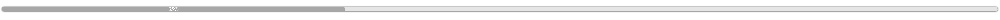

# web-components

## Progress Bar

`progress-bar` is an indicator of completeness of something in %. i.e. (loading, progress).

### Usage

```html
<progress-bar progress="20"> </progress-bar>
```

### Preview


